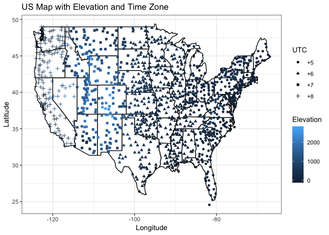

# STAT585_LAB1

## Team Members
- Li Jing
- Zhang Zerui
- Qiao Yang

## Building a book
The last word in Chapter 15 is 'pseudo-class'.

The bigget problem we met: `Error in library(emo): there is no package called 'emo'`. We found the package homepage on GitHub: https://github.com/hadley/emo. It provides the installation method: `devtools::install_github("hadley/emo")`.

# TO BE CONTINUED!


## Weather stations

```r
library(dplyr)
library(readr)
library(ggplot2)
library(stringr)

### US weather stations
ushcn <- read_fwf("ushcn-v2.5-stations.txt", fwf_cols(ID = c(1, 11), LATITUDE = c(13, 20), LONGITUDE = c(22, 30), ELEVATION = c(32, 37), STATE = c(39, 40), NAME = c(42, 71), COMPONENT1 = c(73, 78), COMPONENT2 = c(80, 85), COMPONENT3 = c(87, 92), UTC = c(94, 95)), col_types = cols(UTC = "c"))

ggplot() +
  geom_polygon(aes(x = long, y = lat, group = group), map_data("state"), colour = "black", fill = "white" ) +
  geom_point(aes(x = LONGITUDE, y = LATITUDE, colour = ELEVATION, shape = UTC), ushcn) +
  labs(title = "US Map with Elevation and Time Zone", x = "Longitude", y = "Latitude", color = "Elevation") +
  theme_bw()
```

<!-- -->

```r
### More weather data
raw <- untar("ushcn.tavg.latest.raw.tar.gz", list = T)

cat("There are", length(raw), "of files in the tar.gz file, including 1 folder and", length(raw) - 1, "files in this folder.")
```

There are 1219 of files in the tar.gz file, including 1 folder and 1218 files in this folder.

```r
ID <- ushcn %>%
  filter(str_detect(NAME, fixed("fort dodge", ignore_case = T)), str_detect(STATE, "IA")) %>%
  .$ID %>% .[1]

str_detect(raw, ID) %>%
  raw[.] %>%
  word(-1, sep = "/") %>%
  cat("The file of Fort Dodge, IA is '", ., "'.", sep = "")
```

The file of Fort Dodge, IA is 'USH00132999.raw.tavg'.

## Link
[https://github.com/lijing28101/STAT585_LAB1](https://github.com/lijing28101/STAT585_LAB1)
